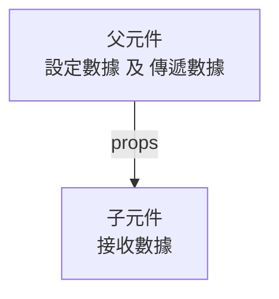
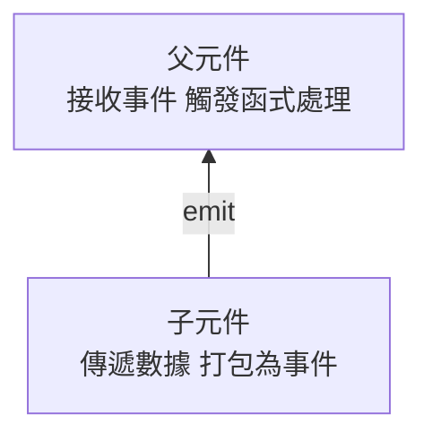

# 資料傳遞 - props 和 emit

## 1. 嵌套元件

`嵌套元件` 就是在一個元件內部 (`父元件`) 使用 另一個元件 (`子元件`)。

使用時，需要先透過 `import` 載入 `子元件`。

### 範例

- 父元件
  ```html
  <script setup lang="ts">
  import Child from './Components/Child.vue'
  </script>
  
  <template>
    <h1>嵌套元件</h1>
    <div>
      <p>我是父元件</p>
      <Child />
    </div>
  </template>
  ```

- 子元件
  ```html
  <template>
    <div>
      <p>我是子元件</p>
    </div>
  </template>
  ```

## 2. props - 資料傳遞 (父傳子)

Props 是 `父元件` 向下 傳遞數據 給 `子元件`



### 語法

- 父元件
  > 透過 `:prop="value"` 傳遞數據

  ```html
  <template>
    <子元件 :屬性="變數、方法" ... />
  </template>
  ```

- 子元件
  > 透過 `defineProps()` 接收數據

  ```ts
  <script setup lang="ts">
  interface Props {
    屬性: 型態, ...
  }
  
  // 接收 props
  const props = defineProps<Props>()
  </script>
  
  <template>
    {{props.屬性}}
  </template>
  ```

### 範例

- 父元件
  ```html
  <script setup lang="ts">
  import { ref } from 'vue';
  import Child from './Components/Child.vue'

  // 傳給子元件的變數
  const name = ref('')

  // 傳給子元件的函式
  const sayHello = (name: string): void => {
    alert(`Hello ${name} !`)
  }
  </script>

  <template>
    <h1>props - 資料傳遞 (父傳子)</h1>
    <div>
      姓名：<input v-model="name" placeholder="請輸入名稱" />
    </div>

    <Child :name="name" :onHello="sayHello" />
  </template>
  ```

- 子元件
  ```html
  <script setup lang="ts">
  interface Props {
    name: string
    onHello: (name: string) => void
  }
  
  // 接收 props
  const props = defineProps<Props>()
  
  </script>
  
  <template>
    <div>
      <button @click="props.onHello(props.name)">
        歡迎訊息
      </button>
    </div>
  </template>
  ```

## 3. emit - 資料傳遞 (子傳父)

emit 是 `子元件` 向上發送事件到 `父元件`



### 語法

- 子元件
  > 透過 `defineEmits()` 設定事件 <br/>
  > 透過 `emit('事件名', 數據)` 發送事件

  ```ts
  <script setup lang="ts">
  // 設定 要傳遞的事件
  const emit = defineEmits(["事件名"])
  const 函式 = () => {
    // 發送事件，可以傳遞數據
    emit('事件名', '數據')
  }
  </script>
  
  <template>
    <button @click="函式">點擊我</button>
  </template>
  ```

- 父元件
  > 透過 `@事件名="處理函數"` 監聽事件

  ```html
  <script setup>
    const 對應函式 = (傳遞資料) => {
      處理邏輯
    }
  </script>

  <template>
    <子元件 @事件名="對應函式" />
  </template>
  ```
  
### 範例

- 子元件
  ```html
  <script setup lang="ts">
  import { ref } from 'vue';

  const name = ref('');

  // 定義 emit
  const emit = defineEmits(["hello"])

  // 觸發 emit
  const sendHello = (): void => {
    emit('hello', name.value)
  }
  </script>

  <template>
    <div>
      姓名：<input v-model="name" placeholder="請輸入名稱" />
    </div>
    <button @click="sendHello">
      送出問候
    </button>
  </template>
  ```

- 父元件
  ```html
  <script setup lang="ts">
  import Child from './Components/Child.vue'
  
  // 接收子元件 emit 的方法
  const handleHello = (msg: string): void => {
    alert(`歡迎 ${msg} !`)
  }
  </script>
  
  <template>
    <Child @hello="handleHello" />
  </template>
  ```